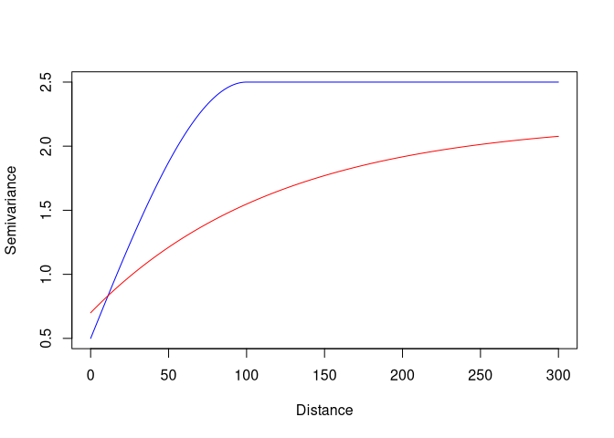

<!-- README.md is generated from README.Rmd. Please edit that file -->

# sacmetrics

<!-- badges: start -->

[](https://lifecycle.r-lib.org/articles/stages.html#experimental)
[](https://github.com/Nowosad/sacmetrics/actions/workflows/R-CMD-check.yaml)
[](https://CRAN.R-project.org/package=sacmetrics)
<!-- badges: end -->

The goal of **sacmetrics** is to calculate spatial autocorrelation
metrics for spatial data.

## Installation

You can install the development version of **sacmetrics** from
[GitHub](https://github.com/) with:

``` r
# install.packages("pak")
pak::pak("Nowosad/sacmetrics")
```

## Example

``` r
library(sacmetrics)
library(gstat)
vgm_model1 = vgm(psill = 2, model = "Sph", range = 100, nugget = 0.5)
vgm_model2 = vgm(psill = 1.5, model = "Exp", range = 120, nugget = 0.7)
plot(variogramLine(vgm_model1, maxdist = 300), type = "l", col = "blue",
     xlab = "Distance", ylab = "Semivariance")
lines(variogramLine(vgm_model2, maxdist = 300), col = "red")
```



``` r
vgm_ssvr(vgm_model1)
#> [1] 0.8
vgm_ssvr(vgm_model2)
#> [1] 0.6818182
```

``` r
vgm_auc(vgm_model1, maxdist = 300)
#> [1] 675.0004
vgm_auc(vgm_model2, maxdist = 300)
#> [1] 494.7753
vgm_compare(vgm_model1, vgm_model2, maxdist = 300)
#> [1] 0.733
```

## Contribution

Contributions to this package are welcome – let us know if you have any
suggestions or spotted a bug. The preferred method of contribution is
through a GitHub pull request. Feel also free to contact us by creating
[an issue](https://github.com/nowosad/sacmetrics/issues).

## Acknowledgments

The initial development of this R package was made possible through the
financial support of the European Union’s Horizon Europe research and
innovation programme under the Marie Skłodowska-Curie grant agreement
No. 101147446 and further supported by the Federal Ministry for Economic
Affairs and Climate Action of Germany (project No. 50EE2009).


## References

- Kerry, R., & Oliver, M. A. (2008). Determining nugget: sill ratios of
  standardized variograms from aerial photographs to krige sparse soil
  data. Precision Agriculture, 9(1), 33-56.
- Vaysse, K., & Lagacherie, P. (2015). Evaluating digital soil mapping
  approaches for mapping GlobalSoilMap soil properties from legacy data
  in Languedoc-Roussillon (France). Geoderma Regional, 4, 20-30.
- Poggio, L., Lassauce, A., & Gimona, A. (2019). Modelling the extent of
  northern peat soil and its uncertainty with sentinel: Scotland as
  example of highly cloudy region. Geoderma, 346, 63-74.
